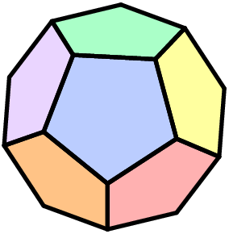

What is the JMC?
================

The JMC (July/January Mathematics Competitions) is a series of mock contests for the AMC, AIME, and ARML. Since the Math Advance website is no longer in service, I have decided to restore access to the PDFs of the papers on this website. Additionally, this page will not contain the MAT (Math Advance Tournament) contests. Sorry.

The MAC Problem Collection contains the problem threads for all of our mock contests and may be accessed [here](https://artofproblemsolving.com/community/c1465090).

---

Past JMC Contests
=================

2026-2027 Season
----------------

To be announced.

2025-2026 Season
----------------

There were no contests this season.

2024-2025 Season
----------------

There were no contests this season.

2023-2024 Season
----------------

There were no contests this season.

2022-2023 Season
----------------

There were no contests this season.

2021-2022 Season
----------------

#### JMC 10 - October 25, 2021 to November 8, 2021

*   Logistics: [AoPS Announcement Post](https://artofproblemsolving.com/community/c594864h2699230)
*   Papers:
    *   [JMC 10 Paper](https://detoasty3.github.io/JMC/2021-2022/2022_JMC_10.pdf)
    *   [JMC 10 Solutions](https://detoasty3.github.io/JMC/2021-2022/2022_JMC_10_Solutions.pdf)

#### JMC 12 - October 25, 2021 to November 8, 2021

*   Logistics: [AoPS Announcement Post](https://artofproblemsolving.com/community/c594864h2699230)
*   Papers:
    *   [JMC 12 Paper](https://detoasty3.github.io/JMC/2021-2022/2022_JMC_12.pdf)
    *   [JMC 12 Solutions](https://detoasty3.github.io/JMC/2021-2022/2022_JMC_12_Solutions.pdf)

#### JIME - January 1, 2022 to February 1, 2022

*   Logistics: [AoPS Announcement Post](https://artofproblemsolving.com/community/c594864h2746699)
*   Papers:
    *   [JIME Paper](https://detoasty3.github.io/JMC/2021-2022/2022_JIME.pdf)
    *   [JIME Solutions](https://detoasty3.github.io/JMC/2021-2022/2022_JIME_Solutions.pdf)

2020-2021 Season
----------------

#### JMC 10 - January 15, 2021 to February 1, 2021

*   Logistics: [AoPS Announcement Post](https://artofproblemsolving.com/community/c594864h2413458)
*   Papers:
    *   [JMC 10 Paper](https://detoasty3.github.io/JMC/2020-2021/2021_JMC_10.pdf)
    *   [JMC 10 Solutions](https://detoasty3.github.io/JMC/2020-2021/2021_JMC_10_Solutions.pdf)

#### JMC 12 - January 15, 2021 to February 1, 2021

*   Logistics: [AoPS Announcement Post](https://artofproblemsolving.com/community/c594864h2413458)
*   Papers:
    *   [JMC 12 Paper](https://detoasty3.github.io/JMC/2020-2021/2021_JMC_12.pdf)
    *   [JMC 12 Solutions](https://detoasty3.github.io/JMC/2020-2021/2021_JMC_12_Solutions.pdf)

#### NARML - October 17, 2020 to December 7, 2020

*   Logistics: [AoPS Announcement Post](https://artofproblemsolving.com/community/c594864h2297113)
*   Papers:
    *   [NARML Paper](https://detoasty3.github.io/JMC/2020-2021/NARML.pdf)
    *   [NARML Solutions](https://detoasty3.github.io/JMC/2020-2021/NARML_Solutions.pdf)

2019-2020 Season
----------------

#### JMC 10 - July 12, 2020 to August 3, 2020

*   Logistics: [AoPS Announcement Post](https://artofproblemsolving.com/community/c594864h2164953)
*   Papers:
    *   [JMC 10 Paper](https://detoasty3.github.io/JMC/2019-2020/2020_JMC_10.pdf)
    *   [JMC 10 Solutions](https://detoasty3.github.io/JMC/2019-2020/2020_JMC_10_Solutions.pdf)